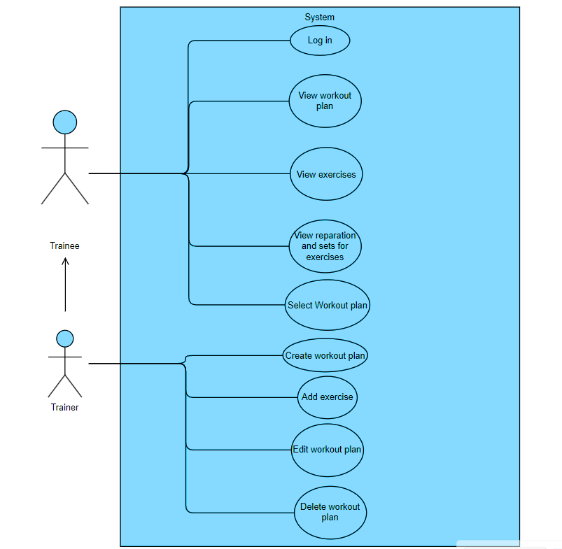
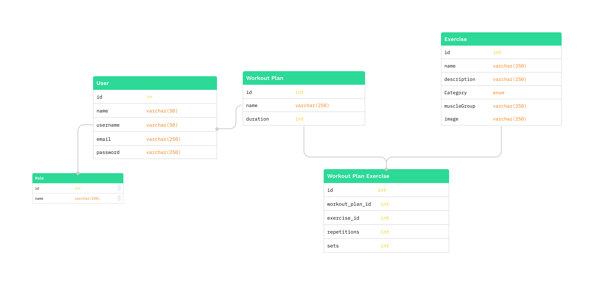
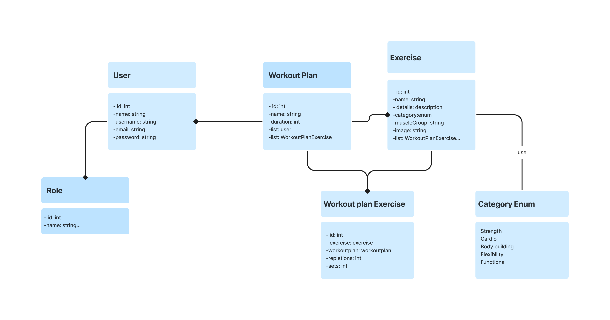

# FitGo

<a name="readme-top"></a>

<!-- TABLE OF CONTENTS -->
<details>
  <summary>Table of Contents</summary>
  <ol>
    <li>
      <a href="#about-the-project">About The Project</a>
      <ul>
        <li><a href="#built-with">Built With</a></li>
      </ul>
    </li>
    <li>
      <a href="#getting-started">Getting Started</a>
      <ul>
        <li><a href="#prerequisites">Prerequisites</a></li>
        <li><a href="#installation">Installation</a></li>
      </ul>
    </li>
    <li><a href="#usage">Usage</a>
 <ul>
        <li><a href="#end-points">End Points</a></li>
      </ul>
</li>
    <li><a href="#roadmap">Roadmap</a>
<ul>
<li><a href="#future-work">Future Work</a></li>
</ul>
</li>
<li><a href="#extra-links">Extra links</a></li>
  </ol>
</details>


<!-- ABOUT THE PROJECT -->
## About The Project

FitGo is a user-friendly fitness application designed to cater to the diverse needs of both trainers and trainees. 
It simplifies the process of finding suitable workout plans and ensuring proper exercise execution. 
With a range of features from viewing available exercises, managing workout plans, to assigning plans to users, FitGo aims to enhance the workout experience and promote a healthier lifestyle.


<p align="right">(<a href="#readme-top">back to top</a>)</p>

### Diagrams

| Use case                                    | Database                                                 | Class      
|---------------------------------------------|----------------------------------------------------------|------------
|  |  | 

### Built With

* ![Java][Java]
* ![spring][spring]
* ![spring-security][spring-security]
* ![jwt][jwt]

<p align="right">(<a href="#readme-top">back to top</a>)</p>


<!-- GETTING STARTED -->
## Getting Started

### Prerequisites

Before you can run the FitGo application, you need to ensure that you have the following software installed:

- [IntelliJ IDEA](https://www.jetbrains.com/idea/): A powerful integrated development environment (IDE) for Java development.
- [Java Development Kit (JDK)](https://www.oracle.com/java/technologies/javase-downloads.html): Java development tools and libraries, **must be version 17**.

### Installation

1. Clone the repo
   ```sh
   git clone https://github.com/DhuhaAhmad/FitGo.git
   ```
2. Enter `application.properties` and change
   ```
    spring.datasource.username=YOUR_ROOT

    spring.datasource.password=YOUR_PASSWORD
   ```
   
3. Enter `FitGoApplication.java` and run `main` method

<p align="right">(<a href="#readme-top">back to top</a>)</p>


<!-- USAGE EXAMPLES -->
## Usage

### End Points

#### Authentication
| Number | Action | URL     | HTTP Verb | Description                      |
|--------|--------|---------|-----------|----------------------------------|
| 1      | Authenticate  | /login  | GET       | Authenticates a user and provides a session token. |

#### Exercises
| Number | Action | URL           | HTTP Verb | Description                      |
|--------|--------|---------------|-----------|----------------------------------|
| 2      | Show   | /exercises    | GET       | Retrieves a list of all available exercises. |

#### Workout Plans
| Number | Action | URL              | HTTP Verb | Description                      |
|--------|--------|------------------|-----------|----------------------------------|
| 3      | Show   | /view-all-plans  | GET       | Displays all available workout plans. |
| 4      | Show   | /:username/view-plan | GET   | Shows the workout plan assigned to a specific user. |

#### User Management
| Number | Action | URL                    | HTTP Verb | Description                      |
|--------|--------|------------------------|-----------|----------------------------------|
| 7      | Update | /assign-user-to-plan   | PUT       | Assigns a workout plan to a specific user. |

#### Update and Deletion
| Number | Action  | URL                     | HTTP Verb | Description                      |
|--------|---------|-------------------------|-----------|----------------------------------|
| 5      | Create  | /add-exercise           | POST      | Adds a new exercise to the database. |
| 6      | Create  | /create-plan            | POST      | Creates a new workout plan. |
| 8      | Update  | /update-workout-plan    | PUT       | Updates an existing workout plan. |
| 9      | Destroy | /delete-workout-plan    | DELETE    | Deletes an existing workout plan. |

<p align="right">(<a href="#readme-top">back to top</a>)</p>


<!-- ROADMAP -->
## Roadmap

-[x] Implement Login Functionality
-[x] Implement Exercise Listing
-[x] Implement Viewing All Workout Plans
-[x] Implement Viewing Specific User's Workout Plan
-[x] Implement Adding New Exercise
-[x] Implement Creating New Workout Plan
-[x] Implement Assigning User to a Workout Plan
-[x] Implement Updating Workout Plan
-[x] Implement Deleting Workout Plan
### Authentication & User Management
<details>
<summary>View Details</summary>

- [x] **Login:** Implement functionality for user authentication.
- [x] **Assign User to Plan:** Capability to assign workout plans to specific users.

</details>

### Exercises & Workout Plans
<details>
<summary>View Details</summary>

- [x] **Exercise Listing:** Implement functionality to list all available exercises.
- [x] **View All Workout Plans:** Implement functionality to view all workout plans.
- [x] **View User’s Workout Plan:** Implement functionality to view a specific user's workout plan.
- [x] **Add New Exercise:** Implement functionality to add a new exercise.
- [x] **Create New Workout Plan:** Implement functionality to create a new workout plan.
- [x] **Update Workout Plan:** Implement functionality to update an existing workout plan.
- [x] **Delete Workout Plan:** Implement functionality to delete an existing workout plan.

</details>


### Future Work

-[ ] Diet and Nutrition
+ Integrate a diet planner with a comprehensive food database for personalized recommendations and meal logging.

-[ ] Food Section
+ Add a section for users to share recipes and access educational content on healthy eating.

-[ ] Customizable Workout Plans
+ Enable users to create their own workout plans with expert guidance and templates.

-[ ] Progress Tracking
+ Implement a dashboard for users to track their fitness progress, set goals, and stay motivated.


<p align="right">(<a href="#readme-top">back to top</a>)</p>

### Extra links
#### presentation: [click here]

<p align="right">(<a href="#readme-top">back to top</a>)</p>

[Java]: https://img.shields.io/badge/java-000000?style=for-the-badge&logo=java
[spring]: https://img.shields.io/badge/spring-1e1e1e?style=for-the-badge&logo=spring
[spring-security]: https://img.shields.io/badge/spring_security-e1e1e1?style=for-the-badge&logo=spring-security
[jwt]: https://img.shields.io/badge/jwt-010101?style=for-the-badge&logo=jwt&logoColor=white
[click here]: https://www.canva.com/design/DAFyiGmBFKI/dDCtq4wx2tcXUKKSBJQsaA/edit?utm_content=DAFyiGmBFKI&utm_campaign=designshare&utm_medium=link2&utm_source=sharebutton


